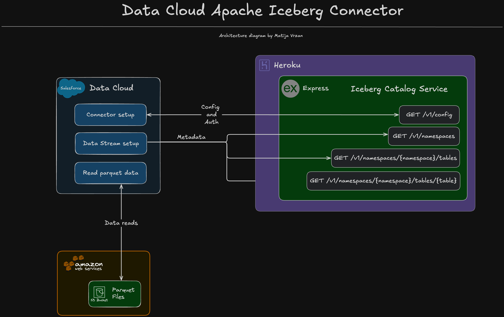

<p align="center">
<a  href="https://www.salesforce.com/"></a>
<a href="https://www.salesforce.com/data/"></a>
<a href="https://iceberg.apache.org/"></a>
<p/>

# Data Cloud Apache Iceberg Connector with S3

Learn how you can leverage Heroku AppLink with a Node.js Express server to exposes your Heroku app as API services in Salesforce.

> **Disclaimer:** At the time of publishing this repository, the official [Data Cloud Apache Iceberg](https://developer.salesforce.com/docs/data/data-cloud-int/guide/c360-a-apacheiceberg-connector.html) connector was in beta

# Table of Contents

- [Data Cloud Apache Iceberg Connector with S3](#data-cloud-apache-iceberg-connector-with-s3)
- [Table of Contents](#table-of-contents)
  - [What Does It Do?](#what-does-it-do)
  - [How does it work?](#how-does-it-work)
  - [Project Structure](#project-structure)
  - [API Documentation](#api-documentation)
    - [Architecture diagram](#architecture-diagram)
  - [Technologies used](#technologies-used)
- [Configuration](#configuration)
  - [Requirements](#requirements)
  - [Setup](#setup)
    - [Local environment configuration](#local-environment-configuration)
  - [Deployment](#deployment)
  - [Troubleshooting](#troubleshooting)
    - [Common Issues](#common-issues)
- [License](#license)
- [Disclaimer](#disclaimer)

---

## What Does It Do?

The Salesforce Data Cloud [Iceberg S3 Connector](https://developer.salesforce.com/docs/data/data-cloud-int/guide/c360-a-apacheiceberg-connector.html) facilitates seamless integration between Salesforce Data Cloud and AWS S3, utilizing Apache Iceberg's table format capabilities. This connector enables:

- **Data Extraction**: Data Cloud to read data directly from an S3 bucket without copying data to Data Cloud (Zero Copy)
- **S3 Storage Integration**: Read parquet files directly from AWS S3
- **Schema Evolution**: Manages schema changes and data versioning through Iceberg's native capabilities

## How does it work?

The Salesforce Data Cloud Iceberg S3 Connector functions as a REST API server that implements the Apache Iceberg REST Catalog API specification, acting as an intermediary between Salesforce Data Cloud and your AWS S3 storage:

1. **REST API Implementation**: The Node.js Express server exposes endpoints that conform to the Apache Iceberg REST Catalog API, including:

- Configuration details via `/v1/config`
- Namespace listings via `/v1/namespaces`
- Table listings within namespaces via `/v1/namespaces/{namespace}/tables`
- Detailed table metadata via `/v1/namespaces/{namespace}/tables/{table}`

2. **Metadata Management**: The server provides standardized Iceberg metadata for tables stored in S3, allowing Data Cloud to understand:

- Table schemas and data types
- File locations in S3
- Table partitioning information
- Schema version history

3. **Zero Copy Architecture**: Instead of importing data into Data Cloud, the connector enables direct reading from S3:

- Data Cloud queries the connector API for table metadata
- Using this metadata, Data Cloud reads Parquet files directly from S3
- Changes to S3 data are immediately visible to Data Cloud queries

4. Deployment Flow:

- Deploy the connector as a Heroku app
- Configure the Apache Iceberg connector in Data Cloud
- Point Data Cloud to your Heroku app URL
- Data Cloud can now query your S3 data using familiar SQL syntax

This implementation allows you to leverage Data Cloud's powerful analytics capabilities while keeping your data in place on AWS S3, reducing data duplication, transfer costs, and synchronization complexity.

> NOTE: This project follows the open source Apache Iceberg API [specifications](https://github.com/apache/iceberg/blob/7f3f450bbddf55bb383ff1409d6d0ca4557c9ffc/open-api/rest-catalog-open-api.yaml), however, for the sake of simplicity, not every route and response is implemented. Just a minimal amount to go through the Data Cloud configuration process.

## Project Structure

```
├── README.md
├── screenshots/                    # Contains images used in documentation
├── server/
│   ├── src/
│   │   ├── controllers/            # API request handlers
│   │   │   ├── config.js            # Config controller
│   │   │   ├── namespaces.js       # Namespace controller
│   │   │   ├── namespaceTables.js  # Tables by namespace controller
│   │   │   └── tableName.js        # Table details controller
│   │   ├── middleware/
│   │   │   └── middleware.js       # Express middleware functions
│   │   ├── routes/
│   │   │   └── catalog.js          # Iceberg REST catalog routes
│   │   ├── utils/
│   │   │   ├── loggingUtil.js      # Logging helper functions
│   │   │   └── metadata.js         # Iceberg schema & metadata definitions
│   │   └── index.js                # Express application setup
│   ├── package.json                # Dependencies and scripts
|   ├── package-lock.json           # Dependencies
│   └── .env.example                # Example environment variables
└── examples/                       # Example files for connector usage
    └── data/                       # Sample table parquet files
    └── metadata/                   # Sample metadata files
```

## API Documentation

- Official Apache Iceberg [Swagger](https://editor-next.swagger.io/?url=https://raw.githubusercontent.com/apache/iceberg/main/open-api/rest-catalog-open-api.yaml) documentation.
- Official Apache Iceberg [specifications](https://iceberg.apache.org/spec/).
- Official Apache Iceberg [GitHub](https://github.com/apache/iceberg).

**Core Endpoints**

- `GET /v1/config` - Returns configuration details for the REST catalog
- `GET /v1/namespaces` - Lists all available namespaces (in this implementation: Database_namespace_one, Database_namespace_two)
- `GET /v1/namespaces/{namespace}/tables` - Lists all tables in a specific namespace
- `GET /v1/namespaces/{namespace}/tables/{table}` - Returns detailed table metadata for a specific table

### Architecture diagram



## Technologies used

- [Node.js](https://nodejs.org/en)
- [Express](https://expressjs.com/)
- [JavaScript](https://developer.mozilla.org/en-US/docs/Web/JavaScript)
- [Salesforce Data Cloud](https://www.salesforce.com/data/)
- [Heroku](https://www.heroku.com/)

For a more detailed overview of the development & production dependencies, please check [`package.json`](./server/package.json).

# Configuration

## Requirements

To run this application locally, you will need the following:

- An active Salesforce account with Data Cloud
- Node.js version 20 or later installed (type `node -v` in your terminal to check). Follow [instructions](https://nodejs.org/en/download) if you don't have node installed
- npm version 10.0.0 or later installed (type `npm -v` in your terminal to check). Node.js includes `npm`
- git installed. Follow the instructions to [install git](https://git-scm.com/downloads)
- A [Heroku account](https://signup.heroku.com/)

## Setup

### Local environment configuration

The first step is to clone the repository and install the project dependencies via a terminal interface by running the `npm install` in the `server` folder:

```
cd salesforce-data-cloud-iceberg-s3-connector/server
npm install
```

The second step is to create a `.env` file in the `server` folder. Find the `.env.example` file, copy it and rename it to `.env`.

```
cd salesforce-data-cloud-iceberg-s3-connector/server
cp .env.example .env
```

Edit the newly created `.env` files and update the variables with your account specific information.

```
# Heroku integration details
APP_PORT=3000
CLIENT_ACCESS_TOKEN=supersecrettoken
S3_BUCKET=
```

Start the development server

```
npm run dev
```

Once all of this is done, your server will be available at http://localhost:3000

> NOTE: If you want to deploy this application to Heroku, you will have to create all of the above variables as Heroku environment variables. This can be done via the [command line or the Heroku Dashboard UI](https://devcenter.heroku.com/articles/config-vars).

## Deployment

Once you are happy with your application, you can deploy it to Heroku!

To deploy the application to Heroku, please follow the [official instructions](https://devcenter.heroku.com/articles/git).

## Troubleshooting

### Common Issues

# License

[MIT](http://www.opensource.org/licenses/mit-license.html)

# Disclaimer

This software is to be considered "sample code", a Type B Deliverable, and is delivered "as-is" to the user. Salesforce bears no responsibility to support the use or implementation of this software.
